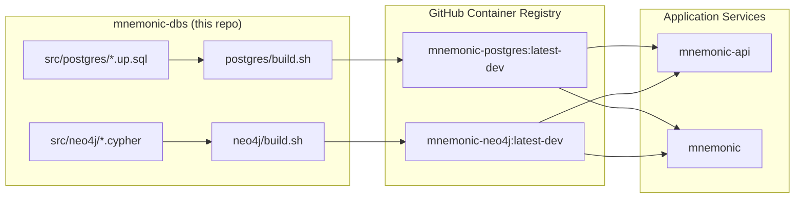

# mnemonic-dbs — Architecture Overview

[Back to Project README](../../README.md)

## Table of Contents

- [Introduction](#introduction)
- [Core Concept](#core-concept)
- [System Model](#system-model)
- [Key Principles](#key-principles)
- [Document Navigation](#document-navigation)

## Introduction

`mnemonic-dbs` owns the database schema and pre-seeded Docker images for the Mnemonic project. It produces two images — `mnemonic-postgres` and `mnemonic-neo4j` — that application services pull directly instead of running migrations at startup.

The repo is intentionally decoupled from the application code. Schema changes are made here, tested, built into new image tags, and consumed by `mnemonic` and `mnemonic-api` by updating their image references. This gives schema changes their own lifecycle: reviewed, tested, and versioned independently.

## Core Concept

## System Model

| Component | Description |
|---|---|
| `src/postgres/` | SQL schema files (`*.up.sql`) and Dockerfile for the Postgres image |
| `src/neo4j/` | Cypher schema files and Dockerfile/build script for the Neo4j image |
| `src/tests/` | BATS test suites and test runner scripts that verify schema correctness |
| `src/docker-compose.yaml` | Local test infrastructure (isolated ports, not used by application services) |
| CI workflow | Triggers on schema file changes, runs tests, builds and pushes both images to GHCR |

## Key Principles

1. **Schema owns its own lifecycle** — changes to the database schema ship as new image tags, reviewed and tested independently of application code.
2. **Self-initializing images** — containers apply the schema on first start with no external tooling required at runtime.
3. **No runtime migration tooling** — application services do not run migrations at startup; they pull images that are already initialized.
4. **Tested before shipped** — BATS tests verify the schema state after initialization runs; CI gates image pushes on passing tests.
5. **Community Edition only** — both images target freely available database editions (pgvector community, Neo4j Community Edition) to avoid licensing constraints.

## Document Navigation

| # | Document | Description | Status |
|---|---|---|---|
| 00 | [Overview](00-overview.md) | This document | Current |
| 02 | [Architectural Decisions](02-architectural-decisions.md) | ADR log | Current |
| 05 | [Deployment Architecture](05-deployment-architecture.md) | Image build and CI/CD pipeline | Current |
| 08 | [Data Architecture](08-data-architecture.md) | PostgreSQL and Neo4j schema reference | Current |

**Next:** [Architectural Decisions](02-architectural-decisions.md)
