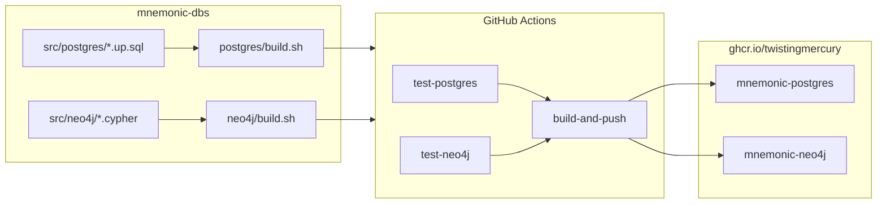

# mnemonic-dbs — Deployment Architecture

[Back to Overview](00-overview.md) | [Back to Project README](../../README.md)

## Table of Contents

- [Deployment Overview](#deployment-overview)
- [Image Build Pipeline](#image-build-pipeline)
- [CI/CD Workflow](#cicd-workflow)
- [Image Tagging Strategy](#image-tagging-strategy)
- [Updates and Rollbacks](#updates-and-rollbacks)

## Deployment Overview

`mnemonic-dbs` does not deploy running services. Its output is two Docker images pushed to GitHub Container Registry (GHCR). Application services pull these images and run them as database containers.



## Image Build Pipeline

### mnemonic-postgres

Built with a standard `docker build`. The `Dockerfile` is in `src/postgres/`:

1. `FROM pgvector/pgvector:pg16`
2. Sets `POSTGRES_DB`, `POSTGRES_USER`, `POSTGRES_PASSWORD` environment variables
3. Copies all `*.up.sql` files into `/docker-entrypoint-initdb.d/`

On first container start, Postgres runs the init scripts in filename order, applying all 10 migrations automatically. No external tooling required.

### mnemonic-neo4j

Built via `src/neo4j/build.sh` using a `docker commit` strategy because Neo4j has no equivalent to `docker-entrypoint-initdb.d`:

1. Build a base image from `src/neo4j/Dockerfile` (`FROM neo4j:5`, env vars set)
2. Start a temporary container from the base image
3. Poll `cypher-shell` until Neo4j is ready (up to 60 seconds)
4. Apply `001_create_constraints.cypher` via `docker cp` + `docker exec`
5. Skip `002_create_existence_constraints.cypher` (Enterprise Edition only)
6. Apply `003_create_indexes.cypher` via `docker cp` + `docker exec`
7. Stop the container
8. Commit to the final image tags
9. Remove the temporary container and base image (via `trap cleanup EXIT`)

## CI/CD Workflow

The workflow at `.github/workflows/mnemonic-ci.yaml` triggers on:

- Push to `main` or `develop` with changes under `src/postgres/**`, `src/neo4j/**`, or the workflow file itself
- Pull requests to `main` or `develop` with the same path filters
- Manual dispatch (`workflow_dispatch`)

**Jobs:**

| Job              | Depends On                    | What It Does                                                            |
| ---------------- | ----------------------------- | ----------------------------------------------------------------------- |
| `test-postgres`  | —                             | Starts local Postgres stack, runs BATS migration tests                  |
| `test-neo4j`     | —                             | Starts local Neo4j container, applies Cypher, runs BATS tests           |
| `build-and-push` | `test-postgres`, `test-neo4j` | Builds both images, logs into GHCR, pushes with version and latest tags |

`test-postgres` and `test-neo4j` run in parallel. `build-and-push` is blocked until both pass.

## Image Tagging Strategy

| Branch                      | Tags Applied                    |
| --------------------------- | ------------------------------- |
| `main`                      | `:latest`, `:{version}`         |
| `develop` (or any non-main) | `:latest-dev`, `:{version}-dev` |

Version is derived from `git describe --tags --abbrev=0`, falling back to `dev` when no tags exist.

Application services reference `:latest-dev` in development and `:latest` (or a specific version tag) in production.

## Updates and Rollbacks

**Schema update process:**

1. Add or modify SQL/Cypher files in `src/postgres/` or `src/neo4j/`
2. Update BATS tests to cover the new schema state
3. Open a PR — CI runs tests and validates the build
4. Merge to `develop`: new `latest-dev` images are pushed
5. Merge to `main`: new `latest` + versioned images are pushed
6. Update image references in `mnemonic` and `mnemonic-api`

**Rollback:**
Pull a prior image tag. Because schema state is baked into the image, rolling back means pointing the application at an older tag. No down migration scripts are maintained.

```bash
# Roll back to a specific version
docker pull ghcr.io/twistingmercury/mnemonic-postgres:v1.0.0
docker pull ghcr.io/twistingmercury/mnemonic-neo4j:v1.0.0
```

**Next:** [Data Architecture](08-data-architecture.md)
