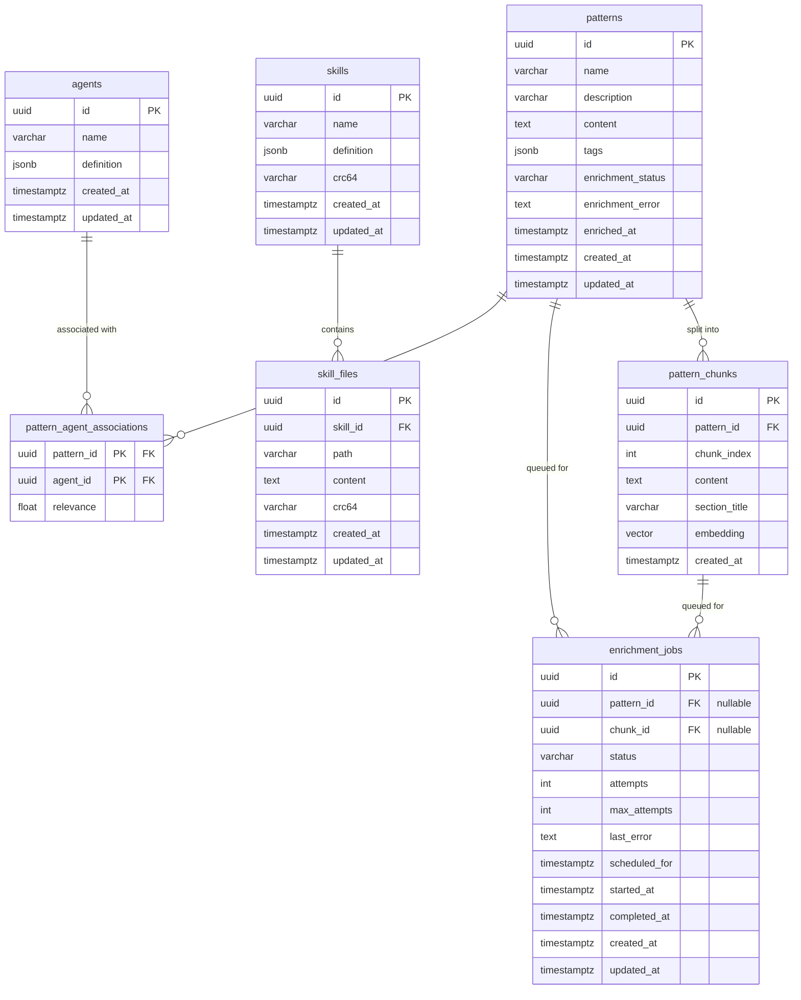

# mnemonic-dbs — Data Architecture

[Back to Overview](00-overview.md) | [Back to Project README](../../README.md)

## Table of Contents

- [Database Technology Stack](#database-technology-stack)
- [PostgreSQL Schema](#postgresql-schema)
- [Neo4j Schema](#neo4j-schema)
- [Migration Strategy](#migration-strategy)

## Database Technology Stack

### PostgreSQL (`pgvector/pgvector:pg16`)

**Purpose:** Relational store for all application entities — agents, patterns, skills, skill files, enrichment jobs, and semantic search chunks. PGVector provides the `vector` extension for embedding storage in `pattern_chunks` and HNSW similarity search.

| Criterion | Requirement | How It Is Met |
|---|---|---|
| Semantic search | Vector similarity over pattern chunk embeddings | `vector` extension with HNSW index |
| Relational integrity | FK constraints between entities | Native Postgres foreign keys |
| Enrichment tracking | Job state and retry tracking | `enrichment_jobs` table with status column |
| Flexible metadata | Tags, agent definitions as JSON | `jsonb` columns with GIN indexes |

### Neo4j (`neo4j:5` Community Edition)

**Purpose:** Knowledge graph projection of Postgres data. Stores `Pattern`, `Agent`, and `Concept` nodes with `RELEVANT_FOR` and `RELATED_TO` relationships to support graph traversal queries that are impractical in SQL (e.g. "find patterns related to X via concept graph").

| Criterion | Requirement | How It Is Met |
|---|---|---|
| Graph traversal | Multi-hop relationship queries | Native Neo4j Cypher traversal |
| Full-text search | Natural language pattern/concept lookup | Fulltext indexes on name and description |
| Uniqueness | One-to-one correspondence with Postgres | Uniqueness constraints on `id` / `name` |

## PostgreSQL Schema

### Entity Relationship Diagram



### Tables

| Table | Migration | Purpose |
|---|---|---|
| `agents` | 000002 | Team agents with JSONB definition blobs |
| `patterns` | 000003 | Reusable context patterns (embeddings moved to pattern_chunks in migration 000009) |
| `pattern_agent_associations` | 000004 | Many-to-many relevance mapping between patterns and agents |
| `enrichment_jobs` | 000005 | Queue and state tracking for pattern/chunk enrichment |
| `skills` | 000007 | Skills owned by agents |
| `skill_files` | 000008 | Individual files belonging to a skill |
| `pattern_chunks` | 000009 | Semantic chunks of patterns with per-chunk embeddings |

### Indexes

| Index | Table | Type | Purpose |
|---|---|---|---|
| `idx_agents_definition` | `agents` | GIN | Fast JSONB queries against agent definition |
| `idx_patterns_enriched` | `patterns` | B-tree | Filter patterns by enrichment status |
| `idx_pattern_chunks_embedding` | `pattern_chunks` | HNSW | Vector similarity search on chunk embeddings (vector(2000)) |
| Various on `enrichment_jobs` | `enrichment_jobs` | B-tree | Status and retry queries |

### Embedding Dimensions

Pattern chunk embeddings were originally `vector(1536)` (text-embedding-3-small). Migration 000010 changed `pattern_chunks.embedding` from `vector(1536)` to `vector(2000)`. (The `patterns.embedding` column was removed in migration 000009.)

## Neo4j Schema

### Node Types

| Label | Unique Constraint | Description |
|---|---|---|
| `Pattern` | `pattern_id_unique` on `id` | Graph projection of a Postgres pattern row |
| `Agent` | `agent_name_unique` on `name` | Graph projection of a Postgres agent row |
| `Concept` | `concept_name_unique` on `name` | Concept extracted during enrichment; lowercase normalized |
| `SchemaVersion` | — | Tracks applied migration version (`v.version`, `v.migratedAt`) |

### Relationships

| Relationship | From → To | Properties | Purpose |
|---|---|---|---|
| `RELEVANT_FOR` | `Pattern → Agent` | `relevance` (float) | Mirrors `pattern_agent_associations` |
| `RELATED_TO` | `Pattern → Pattern` | `similarity` (float) | Graph edges between related patterns |
| `HAS_CONCEPT` | `Pattern → Concept` | — | Concepts extracted from a pattern's content |

### Indexes

| Index | Type | On | Purpose |
|---|---|---|---|
| `pattern_name_index` | B-tree | `Pattern.name` | Name-based pattern lookup |
| `concept_type_index` | B-tree | `Concept.type` | Filter concepts by category |
| `rel_relevant_for_relevance` | B-tree | `RELEVANT_FOR.relevance` | Order relationships by relevance score |
| `pattern_content_fulltext` | Fulltext | `Pattern.name`, `Pattern.description` | Natural language pattern search |
| `concept_name_fulltext` | Fulltext | `Concept.name` | Natural language concept lookup |

Auto-created indexes from uniqueness constraints: `Pattern.id`, `Agent.name`, `Concept.name`.

### Schema Version

The Neo4j schema is versioned via a `SchemaVersion` node:

```cypher
MATCH (v:SchemaVersion {name: 'mnemonic'}) RETURN v.version, v.migratedAt
```

Current version: **3** (set by `003_create_indexes.cypher`).

## Migration Strategy

- **Tooling:** None at runtime. Schema is applied at image build time.
- **Postgres:** SQL files named `000001_description.up.sql` … `000010_description.up.sql`, executed in order by `docker-entrypoint-initdb.d`.
- **Neo4j:** Cypher files named `001_description.cypher` … `003_description.cypher`, applied via `cypher-shell` during image build.
- **Rollback:** Pull a prior image tag. No down migration files are maintained.
- **Testing:** BATS test suites in `src/tests/bats/` verify schema state after initialization. CI gates image pushes on passing tests.
- **Adding migrations:** Add new SQL/Cypher files with the next sequence number, add corresponding BATS assertions, open a PR.
